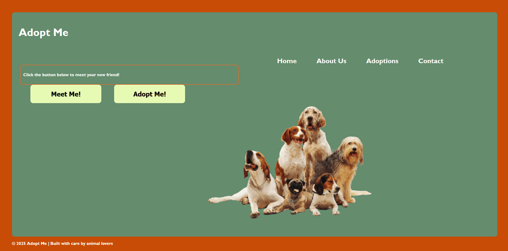

# dog-adoption-website
A website for browsing adoptable dogs by city using HTML, CSS, and JavaScript

> This is our home page! It was first created in GIMP and then translated into HTML and CSS to reflect the design
> initially created, which can be seen in /design-ideas.

> A simple about me page

> This is where the magic happens, you can see here two buttons. The meet me, and adopt me button. 
> The meet me button generates a small, simple page showing your new, furry friend!
> The adopt me button takes you to an adoption request form.

> Here you can see it in action! Once meet me is pressed, a dog is fetched (pardon the pun) for you to meet!
> You can then move onto the adopt me page, which is a fillable form for adoption inquiries.

> A simple contact us form for any questions, comments or concerns.